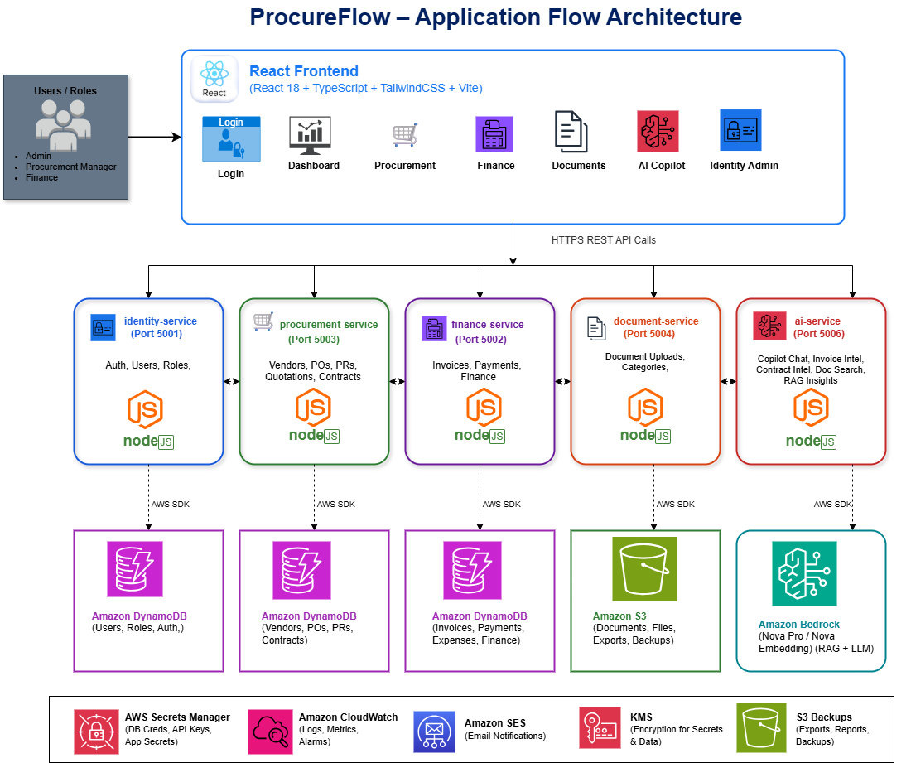

<div align="center">

# Procurement Platform — Application

[](https://github.com/ProcurementPlatform/procurement-platform-app/actions/workflows/build.yml)
[](https://nodejs.org)
[](https://www.typescriptlang.org)
[](https://react.dev)
[](https://aws.amazon.com)
[](https://docker.com)
[](LICENSE)

**A cloud-native, AI-powered procurement management platform** built on a microservices architecture deployed to AWS EKS.

Covers the full procurement lifecycle — vendors, purchase requests, purchase orders, contracts, invoices, payments, documents, HR, and AI-driven insights — all in one unified platform.

[Organization](https://github.com/ProcurementPlatform) · [Infrastructure Repo](https://github.com/ProcurementPlatform/procurement-platform-infra) · [GitOps Repo](https://github.com/ProcurementPlatform/procurement-platform-gitops)

</div>

---

## Application Architecture



---

## Microservices Overview

| Service | Port | Responsibilities | Data Store |
|---|---|---|---|
| **identity-service** | 5001 | Authentication (JWT), Users, Role-Based Access Control, HR (Employees, Payroll, Attendance, Letters) | DynamoDB |
| **procurement-service** | 5003 | Vendors, Purchase Requests, Purchase Orders, Contracts | DynamoDB |
| **finance-service** | 5002 | Invoices, Payments, Customers | DynamoDB |
| **document-service** | 5004 | Document uploads, Audit logs, Notifications | Amazon S3 + DynamoDB |
| **ai-service** | 5006 | Copilot Chat, Invoice Intelligence, Contract Intelligence, Semantic Document Search (RAG) | Amazon Bedrock + DynamoDB |
| **frontend** | 3000 | React SPA — Dashboard, Procurement, Finance, Documents, AI Copilot, Identity Admin modules | — |

All backend services are written in **Node.js + TypeScript + Express** and share packages from `backend/shared/`.

---

## Tech Stack

### Frontend

| Technology | Purpose |
|---|---|
| React 18 + TypeScript | UI framework |
| Tailwind CSS | Utility-first styling |
| Radix UI | Accessible component primitives |
| TanStack React Query | Server state management & caching |
| React Router v6 | Client-side routing |
| Recharts | Data visualization & dashboards |
| Framer Motion | UI animations |
| Axios | HTTP client |

### Backend

| Technology | Purpose |
|---|---|
| Node.js 20 + TypeScript | Runtime & type safety |
| Express.js | HTTP framework |
| Dynamoose | DynamoDB ODM |
| JWT + bcryptjs | Authentication & password hashing |
| Winston | Structured logging |
| Joi | Request validation |
| Prometheus client | Metrics endpoint (scraped by Grafana) |
| UUID | Entity ID generation |

### AWS Services

| Service | Role |
|---|---|
| Amazon EKS (v1.30) | Kubernetes cluster hosting all microservices |
| Amazon DynamoDB | Primary database for all services (15 tables, KMS encrypted) |
| Amazon S3 | Document storage, exports, and backups |
| Amazon Bedrock (Nova Pro + Nova Embedding) | LLM inference and RAG embeddings for AI service |
| Amazon ECR | Private container image registry (6 repositories) |
| AWS Secrets Manager | Runtime secrets pulled via IRSA — no static credentials |
| Amazon CloudWatch | Logs, metrics, and alarms |
| Amazon SES | Email notifications and alerting |
| AWS KMS | Customer-managed encryption keys for all data at rest |

### CI/CD & DevOps

| Tool | Role |
|---|---|
| GitHub Actions | Build, security scan, Docker push, and deploy pipelines |
| SonarCloud | Static code quality analysis |
| Snyk | Dependency vulnerability scanning |
| Trivy | Container image vulnerability scanning (blocks on HIGH/CRITICAL) |
| Docker / Docker Compose | Containerization and local development |
| ArgoCD | GitOps-based deployment to EKS (via gitops repo) |

---

## Repository Structure

```
procurement-platform-app/
├── backend/
│   ├── services/
│   │   ├── identity-service/        # Auth, JWT, users, HR (payroll, attendance, letters)
│   │   │   ├── src/controllers/     # auth, user, hr controllers
│   │   │   ├── src/models/          # User, Employee, Attendance, Payslip, Letter
│   │   │   └── src/services/        # auth, employee, payroll, attendance, letter services
│   │   ├── procurement-service/     # Vendors, PRs, POs, contracts
│   │   │   ├── src/controllers/     # vendor, purchaseRequest, purchaseOrder, contract
│   │   │   ├── src/models/          # Vendor, PurchaseRequest, PurchaseOrder, Contract
│   │   │   └── src/services/        # business logic per entity
│   │   ├── finance-service/         # Invoices, payments, customers
│   │   │   ├── src/controllers/     # invoice, payment, customer
│   │   │   ├── src/models/          # Invoice, Payment, Customer
│   │   │   └── src/services/        # invoice, payment, customer services
│   │   ├── document-service/        # Document storage, audit logs, notifications
│   │   │   ├── src/controllers/     # document, audit, notification
│   │   │   ├── src/models/          # Document, AuditLog, Notification
│   │   │   └── src/services/        # document, audit, notification services
│   │   └── ai-service/              # AI Copilot, RAG, contract & invoice intelligence
│   │       ├── src/controllers/     # chat, contract, invoice, search, feedback
│   │       ├── src/models/          # ContractAnalysis, InvoiceAnalysis, Embedding, Feedback
│   │       └── src/services/        # contract-analysis, invoice-analysis, chat, search, RAG
│   └── shared/
│       ├── common/                  # AWS config, Bedrock client, logger, secrets manager
│       ├── middleware/              # Auth, audit logging, Prometheus metrics, request validation
│       ├── types/                   # Shared TypeScript type definitions
│       └── utils/                   # Helper utilities
├── frontend/
│   └── src/
│       ├── modules/
│       │   ├── ai/                  # Copilot, ContractIntelligence, InvoiceIntelligence, DocumentSearch
│       │   ├── dashboard/           # Dashboard, Reports
│       │   ├── document/            # Documents, AuditLogs, Notifications
│       │   ├── finance/             # Invoices, Payments, Customers
│       │   ├── hr/                  # EmployeeDashboard, Payroll, Attendance, Letters
│       │   ├── identity/            # Login, ForgotPassword, ResetPassword, UserManagement, Settings
│       │   └── procurement/         # Vendors, PurchaseRequests, PurchaseOrders, Contracts
│       ├── components/              # Layout (Header, Sidebar) & common components
│       ├── context/                 # AuthContext (JWT management)
│       ├── services/                # Axios API client & endpoint definitions
│       └── types/                   # Frontend TypeScript types
├── scripts/
│   ├── seed-demo-data.mjs           # Seed all DynamoDB tables with demo data
│   └── generate-seed-pdfs.mjs       # Generate sample PDF documents for seeding
├── .github/workflows/
│   ├── build.yml                    # CI: lint → SonarCloud+Snyk → build → Trivy → ECR push
│   └── deploy.yml                   # CD: read IRSA ARNs → bump gitops values → ArgoCD syncs
├── docker-compose.yml               # Local full-stack development environment
├── package.json                     # NPM workspace root
└── tsconfig.base.json               # Shared TypeScript config
```

---

## CI/CD Pipeline

```
Push to develop / main
        │
        ▼
┌──────────────────────┐
│   Stage 1: Build     │  npm build (backend + frontend TypeScript compilation)
└──────────┬───────────┘
           │  (PR only)
           ▼
┌────────────────────────────┐
│  Stage 2: Code Scan        │  SonarCloud (static analysis) + Snyk (dependency scan)
└──────────┬─────────────────┘
           │  (push only)
           ▼
┌──────────────────────┐
│  Stage 3: Tag Gen    │  develop → git SHA  |  main → semantic version (v1.x.x)
└──────────┬───────────┘
           │
           ▼
┌──────────────────────────────────────────────┐
│  Stage 4: Build + Trivy Scan + ECR Push      │
│  (6 images in parallel matrix)               │  Fails on HIGH/CRITICAL CVEs
│  frontend, identity, procurement, finance,   │
│  document, ai                                │
└──────────┬───────────────────────────────────┘
           │  (main only)
           ▼
┌──────────────────────┐
│  Stage 5: Git Tag    │  Creates and pushes the semver release tag
└──────────┬───────────┘
           │
           ▼
┌────────────────────────────────────────────────┐
│  Deploy workflow (triggered by build success)   │
│  1. Read IRSA ARNs from Terraform remote state  │
│  2. Bump image tags + IRSA annotations in       │
│     values-dev.yaml / values-prod.yaml          │
│  3. Push to procurement-platform-gitops          │
│  ArgoCD detects change → syncs to EKS           │
└────────────────────────────────────────────────┘
```

| Branch | Environment | Image Tag |
|---|---|---|
| `develop` | dev | Git commit SHA (short) |
| `main` | prod | Semantic version (e.g. `v1.2.0`) |

---

## Getting Started

### Prerequisites

- Node.js 20+
- Docker & Docker Compose
- AWS CLI configured (for cloud features)
- Access to AWS DynamoDB, S3, Secrets Manager, and Bedrock

### Clone

```bash
git clone https://github.com/ProcurementPlatform/procurement-platform-app.git
cd procurement-platform-app
```

### Install Dependencies

```bash
npm install
```

### Environment Variables

```bash
cp .env.example .env
```

Key environment variables:

| Variable | Description |
|---|---|
| `AWS_REGION` | AWS region (default: `us-east-1`) |
| `AWS_ACCESS_KEY_ID` | AWS access key (local dev only — not used in EKS/IRSA) |
| `AWS_SECRET_ACCESS_KEY` | AWS secret key (local dev only) |
| `JWT_SECRET` | Secret key for signing JWT tokens |
| `NODE_ENV` | `development` or `production` |

### Run with Docker Compose (Recommended for Local Dev)

```bash
npm run docker:build    # Build all 6 service images
npm run docker:up       # Start all services in background
npm run docker:down     # Stop all services
```

### Run Individual Services (npm workspaces)

```bash
npm run dev:identity      # identity-service only
npm run dev:procurement   # procurement-service only
npm run dev:finance       # finance-service only
npm run dev:document      # document-service only
npm run dev:ai            # ai-service only
npm run dev:backend       # All 5 backend services concurrently
npm run dev:frontend      # React dev server
npm run dev               # Full stack (backend + frontend)
```

### Build

```bash
npm run build             # Build backend + frontend
npm run build:backend     # Backend only (shared packages → services, in order)
npm run build:frontend    # React production build
```

### Seed Demo Data

```bash
node scripts/seed-demo-data.mjs        # Populate DynamoDB tables with demo records
node scripts/generate-seed-pdfs.mjs    # Generate sample PDF documents
```

---

## Shared Backend Packages

The `backend/shared/` directory contains workspace packages used by all services:

| Package | Description |
|---|---|
| `@procurement/types` | Shared TypeScript types and interfaces |
| `@procurement/common` | AWS config, Bedrock client, logger (Winston), secrets manager integration |
| `@procurement/utils` | Utility helpers |
| `@procurement/middleware` | Auth middleware (JWT), audit logging, Prometheus metrics, Joi validation |

Build order matters: `types` → `common` → `utils` → `middleware` → services.

---

## Screenshots

> Screenshots from the live application, ArgoCD, and Grafana monitoring are included in the project presentation below.

📄 **[View Full Capstone Presentation (PDF)](docs/ProcureFlow-Capstone-Project-Review.pdf)**

### Application UI

<!-- Add screenshots from your other laptop here — drag & drop into this folder as docs/screenshots/ -->
<!-- Example:


-->

| Module | Description |
|---|---|
| **Dashboard** | KPI summary, spend analytics, recent activity feed |
| **Procurement** | Vendor directory, purchase request/order workflow, contract management |
| **Finance** | Invoice creation and approval, payment tracking, customer management |
| **Documents** | File upload with S3 backend, category browsing, full audit trail |
| **AI Copilot** | Conversational assistant, contract clause analysis, invoice anomaly detection, semantic search |
| **Identity / HR** | User management, employee profiles, payroll, attendance, HR letters |

### ArgoCD & Monitoring

<!-- Add ArgoCD and Grafana screenshots from your other laptop here -->
<!-- Example:


-->

---

## Related Repositories

| Repository | Description |
|---|---|
| [procurement-platform-infra](https://github.com/ProcurementPlatform/procurement-platform-infra) | Terraform — VPC, EKS, DynamoDB, S3, CloudFront, WAF, IAM/IRSA, KMS, CloudWatch |
| [procurement-platform-gitops](https://github.com/ProcurementPlatform/procurement-platform-gitops) | Helm umbrella chart + ArgoCD App-of-Apps manifests |

---

## Author & Contributors

| Name | Role | GitHub |
|---|---|---|
| **Vinay Kumar Kondoju** | Owner & Lead Developer | [@KONDOJUVINAYKUMAR08](https://github.com/KONDOJUVINAYKUMAR08) |

---

<div align="center">

**Procurement Platform** — Final Capstone Project

Built with Node.js · React · TypeScript · AWS · Kubernetes · Docker · ArgoCD

</div>
